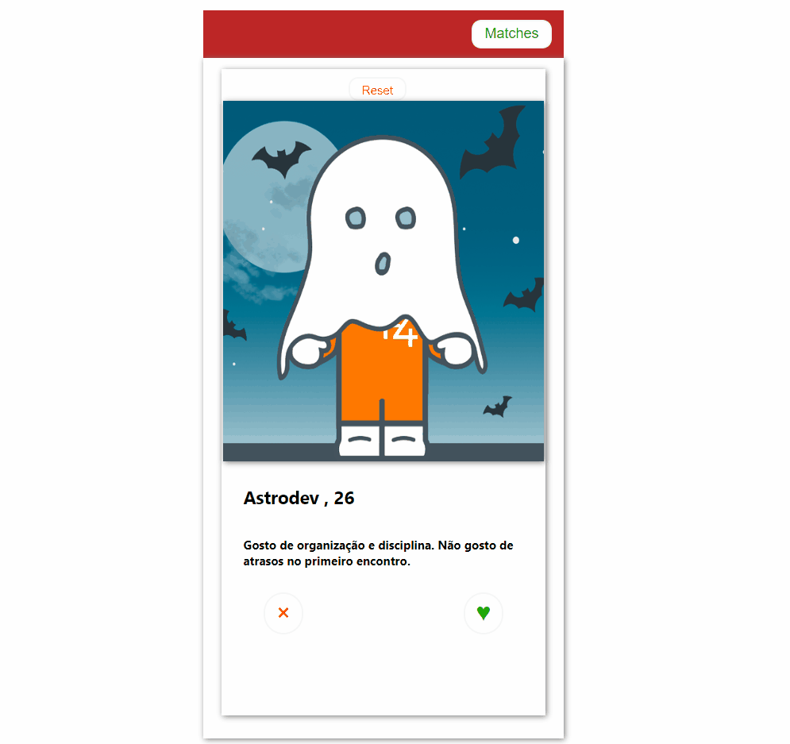

# Astromatch - projeto front-end
## Tinder application clone

> Status do Projeto: Em desenvolvimento :warning:

## Sobre
Esse foi um dos primeiros projetos individuais que fiz em React no bootcamp da Labenu.
Ele consiste em uma plataforma que permite o usuárior aprovar (:heart: dar match) ou desaprovar (:broken_heart: não dar match) algum perfil vindo da API. Caso o perfil da API também tenha dado match no usuário, o aplicativo mostra uma mensagem avisando do match e salvando o perfil em uma lista.

Já que se trata de perfis de uma API, ou seja, perfis limitados, temos a possibilidade de excluir todos os perfis aprovados da lista e retomar desde o início as opões de matchs.

## Stack
:hammer: Esse é um projeto de Frontend Web feito utilizando ReactJS, HTML e CSS. Como gerenciador de pacotes do NodeJS o npm. Além disso, foi um projeto dedicado a utilizar os Hooks useState e useEfecct.

:open_file_folder: Os arquivos foram divididos apenas entre dois `components`, os quais são as páginas propriamente ditas do aplicativo (página onde passam os perfis com a opção de dar match ou rejeitar e a página da lista de todos os perfis que tiveram matches).  Esses dois componentes são chamados no app.js, por meio da renderização condicional. 

      ---> POSSIBILIDADE DE MELHORAR ESSA DIVISÃO EM COMPONENTES.

:art: Para a estilização, utilizou-se a biblioteca STYLED COMPONENTS.

    

## Instruções para rodar
Por ser um projeto com ReactJS, há a necessidade do NodeJS. Após, basta abrir o terminal e navegar até o repositório clonado e rodar:

1. `npm install` para instalar todas as dependências;
2. `npm run start` para rodar localmente o projeto
3. `npm run build` para gerar uma versão estática do projeto 
(que ficará na pasta `build`)

## Deploy da Aplicação com Surge :dash:

> http://astromatch-tatiana.surge.sh/

## Gif:

